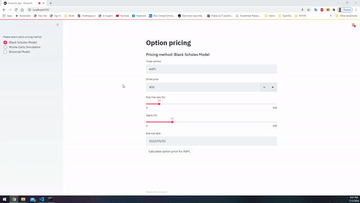
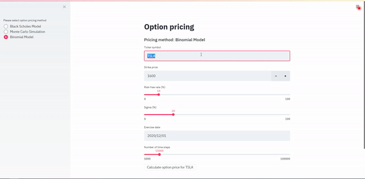

# Option Pricing Simulations

## Introduction

This repository represents simple web app for calculating option prices (European Options). It uses three different methods for option pricing:

1. Black-Scholes Option Pricing
2. Monte Carlo Option Pricing
3. Binomial Tree Option Pricing

Each model has various parameters that user needs to import:

- Ticker
- Strike price
- Expiry date
- Risk-free rate
- Volatility

Option pricing models are implemented in [Python 3.10](https://www.python.org/downloads/release/python-31010/). Latest spot price, for specified ticker, is fetched from Yahoo Finance API. Visualization of the models through simple web app is implemented using [streamlit](https://www.streamlit.io/) library.

When data is fetched from Yahoo Finance API, it's cached with [request-cache](https://github.com/reclosedev/requests-cache) library is sqlite db, so any subsequent testing and changes in model parameters with same underlying instrument won't result in duplicated request for fethcing already fetched data.

## Streamlit web app

1. Black-Scholes Option Pricing

2. Monte Carlo Option Pricing

3. Binomial Tree Option Pricing

## Project structure

| Files                      | Description                                                      |
| -------------------------- | ---------------------------------------------------------------- |
| `demo`                   | contains .gif files as example of streamlit app.                 |
| `option_pricing`         | folder containing python packages where models are implemented.  |
| `option_pricing_test.py` | example code for testing option pricing models (without webapp). |
| `streamlit_app.py`       | web app for testing models using streamlit library.              |
| `Requirements.txt`       | python pip package requirements.                                 |
| `Dockerfile`             | for running containerized streamlit web app.                     |
| `app.yaml`               | for deploying dockerized app on GCP(Google Cloud Platform).      |

## How to run code?

You can use simple streamlit web app to test option pricing models either by manually setting up python environment and running streamlit app or by running docker container.

### **1. Running Docker container**

Dockerfile has exposed 8080 (default web browser port), so when you deploy it to some cloud provider, it would be automatically possible to access your recently deployed web app through browser.

***1.1 Running Docker container locally***
First you will need to build the docker image (this may take a while, because it's downloading all the python libraries from Requirements.txt file) and specify tag e.g. option-pricing:initial:
`docker build -t option-pricing:initial .`

When image is built, you can execute following command, that lists all docker images, to check if image was successfully build:
`docker image ls`

Now, you can run Docker container with following command:
`docker run -p 8080:8080 option-pricing:initial`

When you see output in command line that streamlit app is running on port 8080, you can access it with browser:
`http://localhost:8080/`

***1.2 Deploying Docker container to Google Cloud Platform***
Before you deploy to GCP, please make sure you have google acount, created project on Google Developer Console, set up the billing method (please make sure you understand how Google is charging for hosting!) and downloaded [Google Cloud SDK](https://cloud.google.com/sdk/docs/quickstarts).

To check which project (one from list of projects created on Google Developer Console) is currently used with Google Cloud SDK, use:
`gcloud config get-value project`

To change/set project use:
`gcloud config set project project-name`

When you have correct project in use for Cloud SDK, now you can deploy it using following command (it will use .yaml file from project structure as instructiong on how to deploy it):
`gcloud app deploy`
After choosing neared physical server to host your app, you will have to wait a bit for whole process to finish. Once everything is over, you will be prompted with a link to your web app (you can check that on Developer console as well).
Link for your web app will be something like this: `https://project-name.ey.r.appspot.com/`.

### **2. Running Streamlit app locally with python**

It is recommended that you create new [virtual environment](https://docs.python.org/3.10/tutorial/venv.html):
`python3 -m venv option-pricing`

Then you would need to activate that newly created python environment:

* On Windows:
  `option-pricing\Scripts\activate.bat`
* On Linux:
  `source option-pricing/bin/activate`

Once you have your python environment activated, first you would need to download all necessary python modules with pip. There is Requirements.txt file in scr directory. You can use the following command to automatically download all dependencies:
`pip install -r Requirements.txt`

When the download is completed, you can run streamlit app with:
`streamlit run streamlit_app.py`
